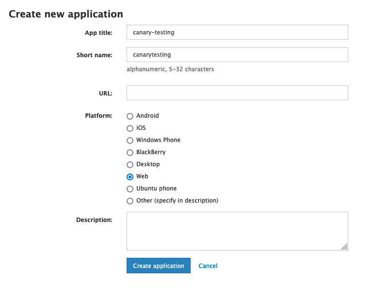
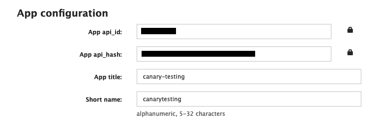

# Telegram API

A simple demo of how to read and write messages to Telegram using GramJS.

## Prerequisites

1. Install dependencies with `npm install`
2. Create a `.env` file within this folder
3. [Log in](https://my.telegram.org/auth) to telegram using the registered phone number of the account you would like to use
4. Proceed to and [create a new application](https://my.telegram.org/apps)
 
5.  You should then be redirected to a page that provides an `API_ID` and `API_HASH` for the app that was just created
 
6. Paste the code snippet below in the `.env` file, and fill up the details for `API_ID` and `API_HASH`. `SESSION_ID` is optional and can be left blank for the time being.

```
API_ID="12345678"
API_HASH="1a2b3c4d5e6f1a2b3c4d5e6f01234567"
SESSION_ID=""
```

## Usage

1. Run `node login.js` first.
2. You will be required to login to your telegram account with your phone number in [international format](https://telegram.org/faq#login-and-sms).
3. An OTP message will be sent your Telegram account. Enter the OTP provided by your account.
4. Enter your password, if any.
5. After successfully logging in, the `SESSION_ID` will be printed on the console. A "Hello!" message will also be sent to your Telegram account's Saved Messages.
6. Copy this `SESSION_ID`  into the `.env` file.

You will not need to run step 1 to 6 subsequently once you have retrieved your `SESSION_ID`.
